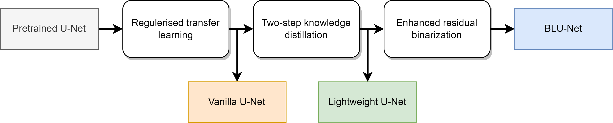

# BLU-Net


An end-to-end network compression framework transfering knowledge from full-precision vanilla U-Net to binary U-Net (BLU-Net).

- Our compressed model, BLU-Net, has an 82.7× smaller size and a remarkable segmentation accuracy of 85.4% IoU (3.4% lower than full-precision vanilla U-Net) on our custom dataset.

    

- We demonstrate that fine-grained hint learning and binarisation can transfer segmentation knowledge across different network architectures, from full-precision vanilla U-Net to binary BLU-Net. 

    

- To our knowledge, this is the first work in binary neural networks for biomedical image segmentation.

## Network Compression Framework


### Environment

```text
python = 3.10.4
tensorflow = 2.9.1
keras = 2.9.0
opencv-python = 4.6.0.66
scipy = 1.7.3
scikit-image = 0.19.2
```

### Software Implementation

```text
BLU-Net
|-  data.py: 
|       dataset class and data pre-processing
|-  data_augmentation.py:
|       data augmentation classes and functions
|-  knowledge_distillation.py: 
|       class and functions to transfer knowledge from vanilla unet to lightweight unet and retraining
|-  model.py:
|       functions to define unet, lightweight unet (lw_unet), lw_unet for hint learning, and blu_net
|-  residual_binarization.py:
|       functions and class to implement residual binary network
|-  training_utils.py:
|       custom training callbacks, learning rate schedular, loss functions, metrics, and dataset split
|-  thesis_experiment
    |-  chapter_3_research_methods.py: 
    |       the model compression framework, including 3 phases.
    |       (a) transfer learning. (b) hint learning (c) residual binarization
    |-  chapter_4_accuracy.py: 
    |       measure model accuracy
    |-  chapter_4_model_size.py: 
    |       measure model size
    |-  chapter_4_inference_latency.py: 
    |       measure coarse inference latency, IO constraint
    |-  chapter_4_ablation_study.py:
            train lw_unet/ blu_net from scratch
```

### Weights and Dataset
- Weights and DIC-1 dataset is [here](https://drive.google.com/drive/folders/1o9MBkHf_eMK7KcSlzOxfFtChHFMRBJm3?usp=sharing), including
  - Custom dataset DIC-1
  - Pretrained u-net for transfer learning
  - Trained blu-net
## Segmentation Examples


